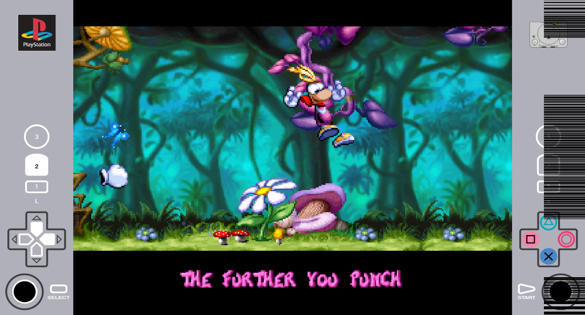
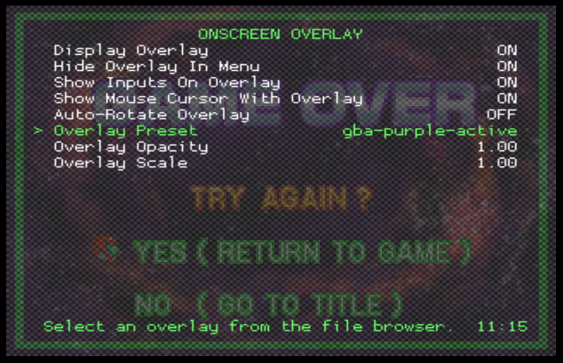
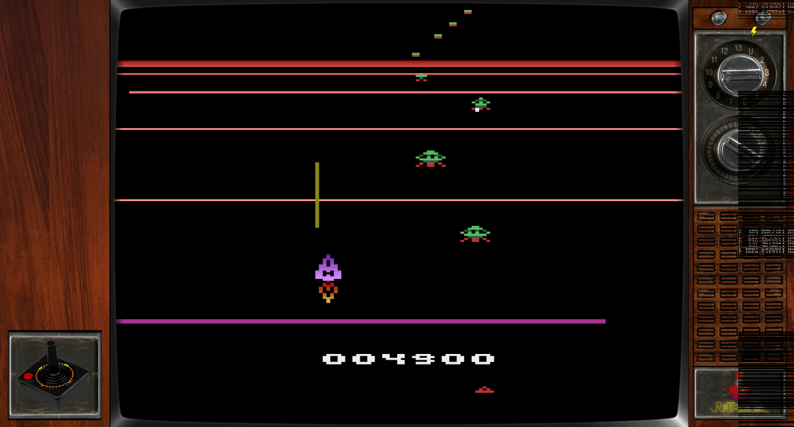
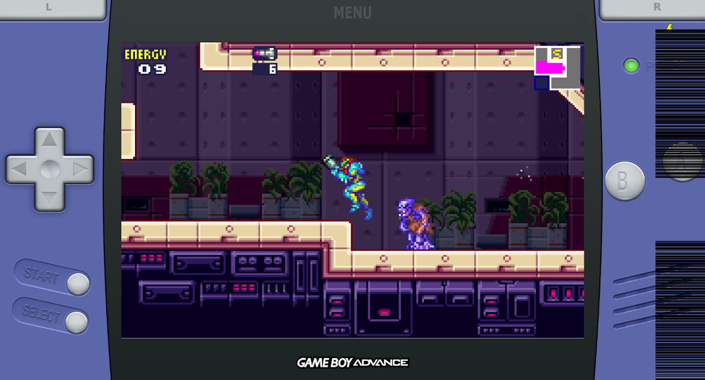
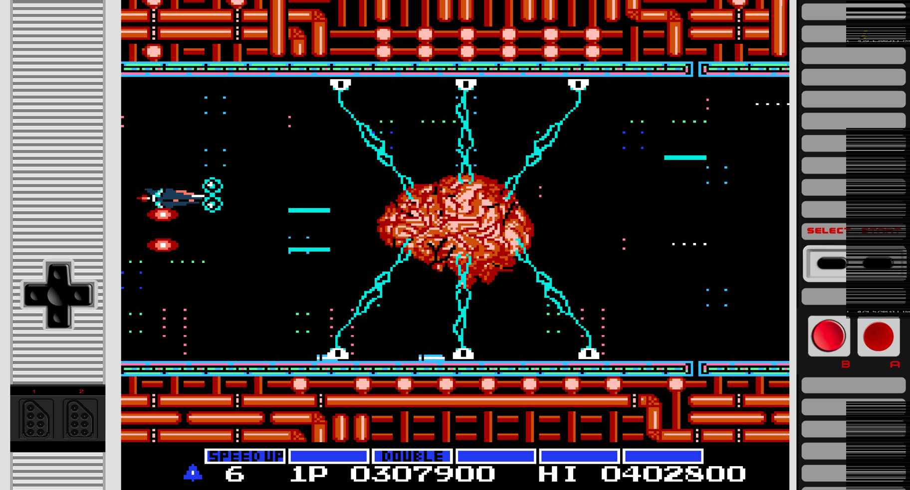
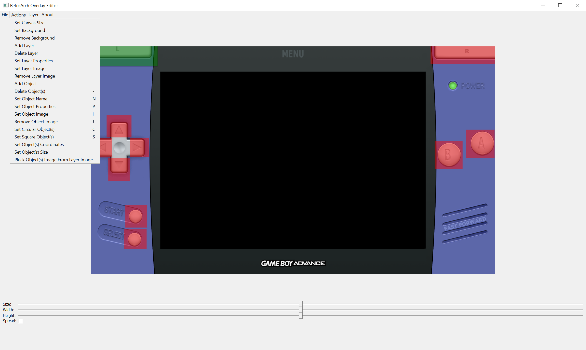

# RetroPie Interactive Screen Overlays

RetroArch input overlays that show gamepad button presses and joystick movement add an exciting dimension to retro-gameplay. They make it easier to remember how gamepads for a variety of systems looked like, and which buttons were present on those gamepads and joysticks. Interactive overlays also provide visual correlation and confirmation of the gamepad button press corresponding to a button on an original gamepad. Although RetroArch has supported interactive overlays since 2017, by 2020 they remain scarce and appear to be focused on reading inputs from user on handheld devices. Specifically RetroPie which is often run on larger non-touch displays with 16:9 aspect ratio doesn't appear to have easy availability of interactive overlays that would enrich retro gaming experience by displaying gamepad inputs. 

This repository contains a curated collection of interactive overlays for use with RetroPie 4.6. Currently supported systems are Atari 2600, GBA, NES, and PSX. These overlays are harvested from the internet, all of them are modified and cleaned up to better work with RetroPie and some are completely new derivative works of non-interactive overlays found online.
  
<br/>
PS1 gameplay with active overlay showing gamepad buttons being pressed in real time

## How to install

To install overlays in this repository, clone it to your RetroPie installation and run `install-overlays.sh` shell script as shown below. These overlays have been tested on RetroPie 4.6 running at 1080p resolution on 16:9 aspect ratio TV.

```
pi@retropie:~ $ sudo apt -y install git
pi@retropie:~ $ cd /tmp
pi@retropie:/tmp $ git clone https://github.com/etheling/retropie-ia-overlays
pi@retropie:/tmp $ cd retropie-ia-overlays
pi@retropie:/tmp/retropie-ia-overlays $ chmod +x ./install-overlays.sh
pi@retropie:/tmp/retropie-ia-overlays $ ./install-overlays.sh
...
```

This will copy them to the `/opt/retropie/emulators/retroarch/overlays` on RetroPie. To test the overlays, enable them manually via RetroArch menu (F1->Quick Menu->Onscreen Overlay). For the overlays to display properly, it's important to enable `Show inputs on overlay` setting and set `Overlay Opacity` to 1.0 (defaults to 0.75). Unless opacity is set to 1.0, some overlays will display uneven coloring around interactive gamepad buttons.



To load these overlays automatically, do it via systems specific RetroArch config files. Below is a sample on how to do this for Atari 2600 via `/opt/retropie/configs/atari2600/retroarch.cfg`. Overlays chapter includes configuration changes required for each system, including viewport or shader changes that may be required by a specific overlay. 

```
pi@retropie:~ $ tail -8 /opt/retropie/configs/atari2600/retroarch.cfg
## Overlay old TV
input_overlay_enable = "true"
input_overlay = "/opt/retropie/emulators/retroarch/overlays/ia-atari2600-tv.cfg"
input_overlay_show_physical_inputs = "true"
input_overlay_opacity = "1.000000"
input_overlay_scale = "1.000000"

#include "/opt/retropie/configs/all/retroarch.cfg"
```

These overlays are built in such a way that overlay directory `/opt/retropie/emulators/retroarch/overlays` will contain a .cfg file for each interactive overlay, and then assets for each overlay are placed in the subdirectory corresponding to the .cfg filename (e.g. ./ia-ps1/ for ./ia-ps1.cfg) . This is done to avoid cluttering the overlay directory with a number of .png files with potentially conflicting names.

## Overlays

These overlays are intended for RetroPie setups with 16:9 aspect ratio TV running at 1080p resolution. They have been created for and tested with RetroPie 4.6. 

They are derivative works of overlay configurations, screens and icons made by others. Each section below provides links to the original source where artwork was found online. If you're the author of these graphics, and don't want them to be used here, please submit a pull request and ask me to remove your works. For any planned usage that might be commercial in nature, contact original authors of artwork.

Psx overlay uses the most comprehensive set of RetroArch screen overlay features. It and other overlays here are hopefully useful as examples of how to create interactive screen overlays for RetroPie.

### Atari 2600 overlay

This overlay (`ia-atari2600-tv.cfg`) is based on 'TV overlay' posted to [RetroPie forums](https://retropie.org.uk/forum/topic/13408/tv-overlay). It has been modified to include an Atari joystick at the lower left corner that will display fire button presses and d-pad up,down,left and right events. It has also been slightly altered to match Atari 2600 view port in RetroPie 4.6 default configuration.



To load this overlay, add following lines to the Atari2600 RetroArch config at `/opt/retropie/configs/atari2600/retroarch.cfg` or enable it manually via rgui:

```
## Overlay old TV
input_overlay_enable = "true"
input_overlay = "/opt/retropie/emulators/retroarch/overlays/ia-atari2600-tv.cfg"
input_overlay_show_physical_inputs = "true"
input_overlay_opacity = "1.000000"
input_overlay_scale = "1.000000"
```

Other Atari 2600 joystick graphics that can be useful in creating interactive overlays: [#1](https://www.pngegg.com/en/png-zpqbt), [#2](https://www.pngegg.com/en/png-bxpyz).

### GBA (Gameboy advance) overlay

GBA overlay (`ia-gba-purple.cfg`) is based on overlay available [here](http://thatlostpacket.com/retrogbaoverlay.html). It has been modified to remove 'fast forward' 'button' and to create 'pressed button feel' for buttons. <!-- Gimp, increasing buttons contrast by 40% -->
 
 
 
 To load this overlay, and to also properly set display port size to fit the overlay and enable GBA color palette shaders, add following lines to the gba RetroArch config at `/opt/retropie/configs/gba/retroarch.cfg` or enable it manually via rgui:
 
 ```
input_overlay_enable = "true"
input_overlay = "/opt/retropie/emulators/retroarch/overlays/ia-gba-purple.cfg"
input_overlay_opacity = "1.000000"
input_overlay_scale = "1.000000"
input_overlay_show_physical_inputs = "true"

## https://retropie.org.uk/forum/topic/19598/custom-viewport-problem-retroarch-1-7-5/3
## match input overlay; menu edit via F1 -> settings -> video -> scaling
aspect_ratio_index = "23"
custom_viewport_width = "1260" 
custom_viewport_height = "840"
custom_viewport_x = "330"
custom_viewport_y = "120"

## Enable GBA color scheme
video_shader_enable = true
video_shader_dir = "/opt/retropie/emulators/retroarch/shader/"
video_shader = “/opt/retropie/emulators/retroarch/shader/gba-color.glslp” 
 ```


### NES (Nintendo Entertainment System) overlay

This overlay (`ia-nes.cfg`) is based on the interactive NES overlay found from RetroArch [overlay documentation](https://github.com/libretro/common-overlays/tree/master/borders/nes-anim-border). 

 
 
To load this overlay, add following lines to the NES RetroArch config at `/opt/retropie/configs/nes/retroarch.cfg` or enable it manually via rgui:

```
## Overlay old TV
input_overlay_enable = "true"
input_overlay = "/opt/retropie/emulators/retroarch/overlays/ia-nes.cfg"
input_overlay_show_physical_inputs = "true"
input_overlay_opacity = "1.000000"
input_overlay_scale = "1.000000"
```

NOTE: https://www.pngegg.com/en/png-yqsic (other gamepad for use with NES overlays)

### Playstation 1 overlay

This overlay (`ia-ps1.cfg`) is based on an excellent example of interactive PS1 controller overlay found from [RetroArch forums](https://github.com/libretro/RetroArch/issues/5214). It has been edited lightly to make it work in RetroPie (original only works in Windows due to path issues), and Playstation 1 'themed' side panels with PS logo and console icon have been added. This is the most complete and complex overlay in this set and has a placeholder for all the Xbox gamepad buttons (except for the XBox button). Specifically it properly displays analog stick movements. 


To load this overlay, add following lines to the psx RetroArch config at `/opt/retropie/configs/psx/retroarch.cfg` or enable it manually via rgui:

```
input_overlay_enable = "true"
input_overlay = "/opt/retropie/emulators/retroarch/overlays/ia-ps1.cfg"
input_overlay_opacity = "1.000000"
input_overlay_scale = "1.000000"
input_overlay_show_physical_inputs = "true"
```

## Getting started with creating RetroArch interactive overlays [for use with RetroPie]

To get started read [RetroArch screen overlays](https://docs.libretro.com/guides/libretro-overlays/) system documentation and developer documentation pertaining to [show inputs on overlay](https://docs.libretro.com/development/retroarch/input/overlay/) features. To create interactive overlays [RetroArch Overlay Editor](https://www.libretro.com/index.php/retroarch-overlay-editor-create-and-edit-your-own-overlays-easily-now-available-for-free/) will greatly simplify the process. Although it appears it's not always possible to create a finished active overlay with it, it will get you there most of the way and be invaluable in being able to extract 'button press'-areas from the overlay background. Indeed it appears that overlay editor is more geared towards creating overlays that can be used in handheld devices to read in user input, rather than ones that would be used to display gamepad events in RetroPie-type environments. As of June 2020, only pre-compiled Windows binary for the Overlay Editor is provided.

Please note that this section is not a comprehensive guide to creating an active overlay, but rather presents high level steps to take to create an interactive overlay. Overlays in this repository should be used as an additional reference on how to build one. If there are alternative ways to create active overlays, please submit a pull request with the information.



### Steps to create interactive overlay with RetroArch Overlay Editor

Approximately following steps are required to build interactive overlay for RetroPie with RetroArch overlay editor:

1. Start RetroArch overlay editor and set asset sizes: `Actions -> Set Canvas Size -> 1920, 1080`.
2. Add background image as a layer image (NOT as a background)
3. Add objects for each button that you wish to make active: `Actions -> Add Object (+)`
4. Size them appropriately and make them square objects `Actions -> Set Square Object(s) (S))
5. Fit objects on the buttons so that they don't overlap and that they stay out of emulator display area
6. Name objects to map them to gamepad buttons. See [RetroArch documentation](https://docs.libretro.com/development/retroarch/input/overlay/) and e.g. ia-ps1.cfg.
7. Extract images for buttons from background: `Actions -> Pluck Object(s) Image from Layer Image` (these will overlay background)
9. Save configuration in Overlay Editor making sure assets are saved/created for each button
8. Go to Gimp, PS, etc. and edit a copy of background image to make all buttons etc. pressed (this image will be overlayed by extracted buttons)
10. Edit saved overlay configuration to change background to the one with pressed button look
11. Test and manually clean up overlay configuration

Of all the steps outlined above, it appears that steps 10 and 11 can take a lot of time and overlay configuration is likely to require manual changes before it will behave as expected. After some experimentation, what appears to work best is that displaying button presses on the overlay is done in a subtle enough manner as not to distract from the gameplay. 


## Future work

- Test what happens when used in 4k, 720p resolutions (now only 1080p tested)
- Genesis overlay - gamepad https://www.pngegg.com/en/png-fmvvn
- Test overlay for various overlay framework features
- Fix screenshots


